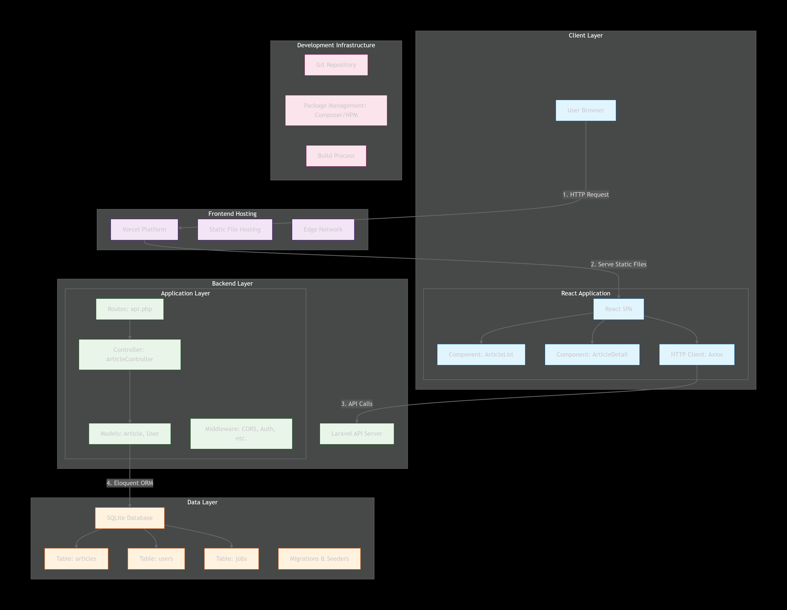
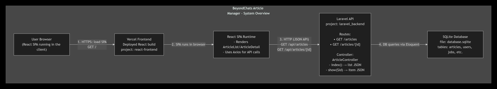
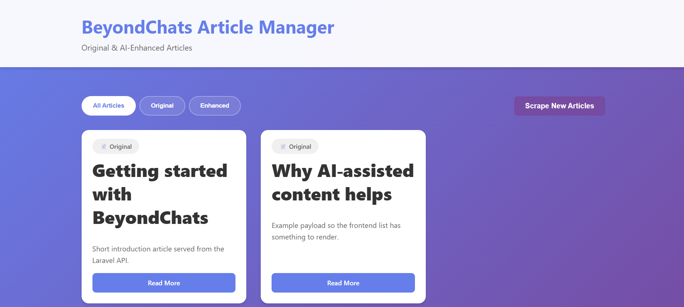

# BeyondChats Article Manager

A small full‑stack application that exposes a JSON articles API using Laravel and a single‑page UI built with React. The project demonstrates a clean separation between the backend API and the frontend client.

---
## Live demo

- Frontend (Vercel): https://vercel.com/dhruvsingh1802s-projects/article-manager

## Diagrams

### 1. System Architecture Diagram

High‑level view of the entire system: user browser, React frontend on Vercel, Laravel API backend, and SQLite database.

---

### 2. Data Flow Diagram

End‑to‑end data flow for typical interactions:

1. User opens the Vercel URL and loads the React SPA.
2. SPA calls `GET /api/articles` and `GET /api/articles/{id}` on the Laravel API.
3. Laravel reads data from SQLite and returns JSON.
4. SPA renders article list and detail views.

## Screenshots

## Features

- List of articles loaded from a Laravel JSON API
- Detail page for a single article
- Simple routing on the frontend with React Router
- Local SQLite database for the backend (no external DB required)
- Clear separation of `laravel_backend` and `react-frontend` folders

---

## Tech stack

**Frontend**

- React
- React Router
- Axios
- Vite or Create React App (depending on how the project was created)
- CSS modules / plain CSS

**Backend**

- PHP 8+
- Laravel
- SQLite

---

## Project structure
ProjectMaNAGE/
laravel_backend/ # Laravel API application
app/
bootstrap/
config/
database/
public/
routes/
...
react-frontend/ # React frontend application
src/
components/
App.jsx / App.js
main.jsx / index.js
public/
...
README.md
QUICKSTART.md
ARCHITECTURE.md
---

## Prerequisites

- Node.js (LTS)
- npm or yarn
- PHP 8.1+ installed and available on the PATH
- Composer installed
- Git (optional, but recommended)

---

## Local setup (short version)

1. Clone the repository.
2. Install and run the Laravel backend.
3. Install and run the React frontend.
4. Open the React dev server in the browser.
